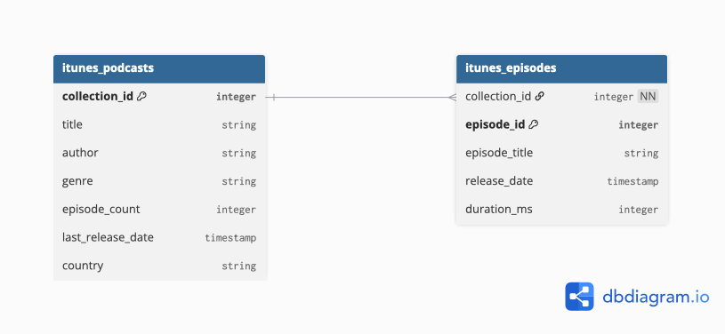
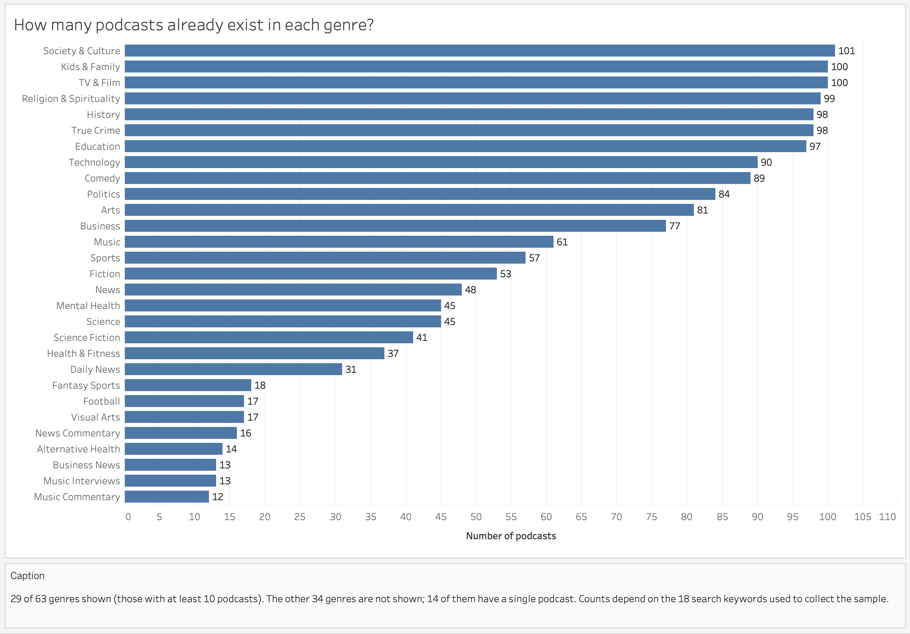
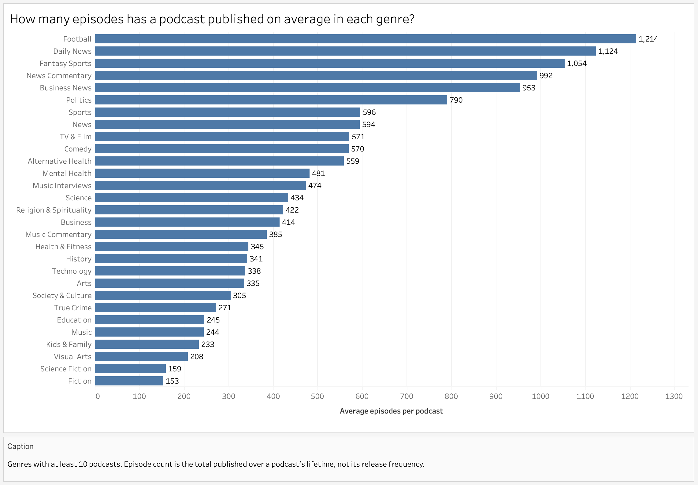
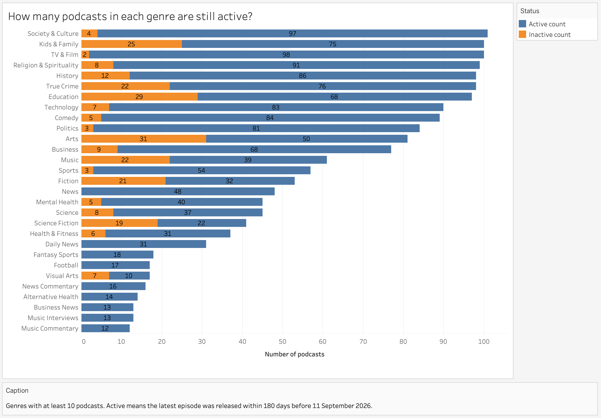
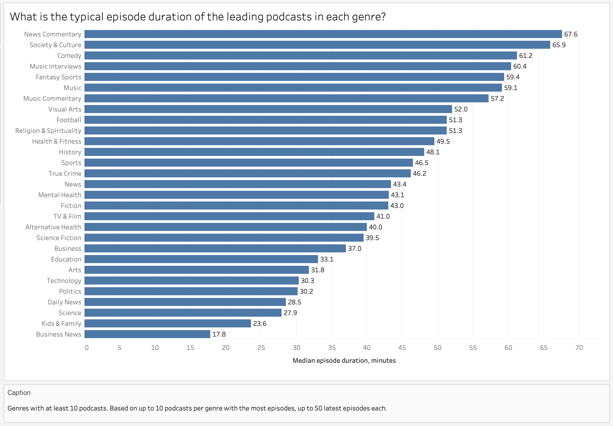

# Podcast Genre Market Analysis — iTunes Search API Snapshot, September 2026

**Tools:** BigQuery SQL, Tableau Public, Python (data collection)

**SQL skills:** CTEs, joins, GROUP BY and HAVING, CASE WHEN, COUNTIF, APPROX_QUANTILES

**Data:** iTunes Search API (Apple Podcasts), snapshot of September 2026

## Table of Contents

- [Project Background](#project-background)
- [Executive Summary](#executive-summary)
- [Data Structure Overview](#data-structure-overview)
- [Insights Deep Dive](#insights-deep-dive)
- [Recommendations](#recommendations)
- [Assumptions and Caveats](#assumptions-and-caveats)
- [Technical Details](#technical-details)

## Project Background

An independent podcast studio is planning to launch a new podcast. Before launch, the head of content needs to decide on a genre, based on data from the iTunes Search API. The decision should take into account how saturated the genre already is with competitors, how active it currently is, and what the typical episode format looks like. The final recommendation will inform the launch decision and will be used by the team.

## Executive Summary

The analysis covers 1,747 podcasts across 63 genres. It is a snapshot of the iTunes Search API collected on 11 September 2026. The head of content at an independent podcast studio has to choose a genre for a new podcast, and the analysis helps compare genres. It compares the 29 genres that contain at least 10 podcasts.

The largest genres contain about 100 podcasts, for example Society & Culture (101). 14 genres have only one podcast. News and sports podcasts have the biggest catalogs: in Football, Daily News, Fantasy Sports, News Commentary, and Business News a podcast has published 953 to 1,214 episodes on average, and every podcast in the sample is still publishing. Fiction and Science Fiction have the smallest catalogs (153 and 159 episodes), but 40% and 46% of their podcasts no longer publish. A typical episode runs from 17.8 minutes in Business News to 67.6 in News Commentary.

There is no audience data, and the sample was collected with 18 search keywords. So the analysis shows what is on the market, not what people listen to.

## Data Structure Overview

- **`itunes_podcasts`**: one row is one podcast (1,747 rows). Columns: podcast identifier (`collection_id`, primary key), title, author, genre, total episodes published over the podcast's lifetime (`episode_count`), date of the latest release (`last_release_date`), and country (`country`, US in every row).
- **`itunes_episodes`**: one row is one episode (18,594 rows). Columns: podcast identifier (`collection_id`, foreign key to `itunes_podcasts`), episode identifier (`episode_id`, primary key), episode title, release date (`release_date`), and duration in milliseconds (`duration_ms`). Episodes are available for 383 of the 1,747 podcasts (see Caveats).
- The tables are joined on `collection_id`: one podcast has many episodes.

## Insights Deep Dive

### Genre saturation

- The sample contains 1,747 podcasts across 63 genres.
- The largest genres are Society & Culture (101 podcasts), Kids & Family and TV & Film (100 each), Religion & Spirituality (99), and True Crime and History (98 each).
- 14 genres have only one podcast each, including Careers, Documentary, Fitness, and Fashion & Beauty.

### Content volume

- The 1,747 podcasts across 63 genres have published 756,858 episodes in total.
- Among genres with at least 10 podcasts, news and sports podcasts have the most episodes: Football (1,214 episodes per podcast on average; 17 podcasts in the genre), Daily News (1,124; 31), Fantasy Sports (1,054; 18), News Commentary (992; 16), and Business News (953; 13).
- Among these genres, the fewest episodes per podcast are in Fiction (153; 53 podcasts), Science Fiction (159; 41), Visual Arts (208; 17), and Kids & Family (233; 100).
- Genres with fewer than 10 podcasts are not compared (see Caveats).

### Genre activity

- A podcast is counted as active if its latest episode was released within 180 days before the data was collected, on 11 September 2026.
- 1,489 of 1,747 podcasts are active (85%). In 37 of 63 genres every podcast is active; the other 26 genres contain inactive podcasts.
- All five genres with the largest catalogs from the content volume analysis (Football, Daily News, Fantasy Sports, News Commentary, Business News) are 100% active.
- Among genres with at least 10 podcasts, the lowest share of active podcasts is in Science Fiction (22 of 41; 54%), Visual Arts (10 of 17; 59%), Fiction (32 of 53; 60%), and Arts (50 of 81; 62%).
- Some of the largest genres also have a notable share of inactive podcasts: Education (68 of 97 active; 70%) and Kids & Family (75 of 100; 75%).
- Genres with fewer than 10 podcasts are not compared, because a share over a small number of podcasts is unstable (for example, Stand-Up: 0 active out of 3).

### Episode format

- The analysis covers the leading podcasts: up to 10 podcasts per genre with the most episodes, up to their 50 latest episodes each (see Caveats). It compares the 29 genres that contain at least 10 podcasts.
- Typical episode duration is measured by the median: durations range from 30 seconds to about 346 minutes, and a few very long episodes would strongly shift the mean.
- Episodes are longest in News Commentary (67.6 minutes; 9 podcasts in the sample), Society & Culture (65.9), Comedy (61.2), and Music Interviews (60.4; 9 podcasts).
- They are shortest in Business News (17.8 minutes), Kids & Family (23.6), Science (27.9), and Daily News (28.5).
- In the genres with the most podcasts, the typical episode ranges from 23.6 minutes (Kids & Family) to 65.9 (Society & Culture).
- Duration is not known for every episode: the largest gap is in Alternative Health (398 of 500 episodes).

## Recommendations

Assumption: the studio wants to reach a content volume similar to its competitors. This needs to be confirmed with the stakeholder (see Caveats).

**1. Consider Fiction and Science Fiction if the studio wants a smaller catalog to catch up with.**

Fiction and Science Fiction have the smallest catalogs of the compared genres, 153 and 159 episodes per podcast. A typical episode there is about 40 minutes. But these genres are mid-sized (53 and 41 podcasts), and 40% (Fiction) and 46% (Science Fiction) of their podcasts no longer publish. The genre may be hard to keep going, or it may simply have fewer active competitors. The data cannot tell which, and there is no audience data.

*Basis: Content volume, Genre activity, Episode format.*

**2. Avoid Football, Daily News, Fantasy Sports, News Commentary, and Business News if the studio cannot build a large catalog quickly.**

A podcast in these genres has published 953 to 1,214 episodes on average, and every podcast in the sample is still publishing. The competitors are active and have large catalogs.

*Basis: Content volume, Genre activity.*

**3. After choosing a genre, plan the episode length by that genre's norm.**

The norm differs a lot: 23.6 minutes in Kids & Family, 61.2 in Comedy, 65.9 in Society & Culture. Comedy and Society & Culture episodes are 2.5 to 3 times longer than Kids & Family episodes, so the work behind each episode is very different.

*Basis: Episode format.*

## Assumptions and Caveats

### Data limitations

- Source and date: iTunes Search API (Apple Podcasts), a one-time snapshot collected on 11 September 2026. The data contains no time series.
- The 1,747 podcasts are deduplicated search results for 18 keywords (up to 200 results per keyword). They are not the full market and not a chart ranking. The number of podcasts per genre depends on the search keywords: the largest genres reach a ceiling of about 100, while smaller genres entered the sample incidentally.
- All data is from the US store; regions cannot be compared.
- There is no audience data (plays, downloads, ratings), so no conclusions about popularity can be drawn. "Leaders" in the episode format analysis means the podcasts with the most episodes in a genre, not the most listened to.
- Episode-level data exists for 383 of the 1,747 podcasts: up to the top 10 podcasts per genre by total episode count, with up to the 50 latest episodes each. Episode dates therefore reach back to 2015; this is a side effect of the sample, not a chosen period.
- The collection script selected 385 podcasts for episode data (up to 10 per genre), but the API returned no episodes for 2 of them. This is why News Commentary and Music Interviews have 9 podcasts in the sample instead of 10.
- `episode_count` is the total number of episodes over a podcast's lifetime, not its release frequency. Podcast age and release frequency cannot be separated.
- 43 podcasts have exactly 2,000 episodes, the most frequent value in the column. The reason is unknown; averages for the largest genres may be understated.

### Assumptions and data handling

- 33 podcasts have a last release date after the collection date, most likely scheduled episodes. They are counted as active.
- Genres are compared only if they contain at least 10 podcasts. An average or share over a small number of podcasts describes those podcasts, not the genre: in a genre with three podcasts, one podcast moves a share by 33 percentage points.
- 376 episodes (about 2%) have no duration and are excluded from the median. Durations range from 30 seconds to about 346 minutes, so the median is used instead of the mean. The `episodes_used` column shows how many episodes each median is based on.
- Medians are computed with the BigQuery function `APPROX_QUANTILES`, so they are approximate and may differ slightly from exact medians.
- One episode title contains a line break, so the CSV was loaded into BigQuery with the quoted newlines option enabled.

### Clarifying questions for the stakeholder

- Is there access to listening data or ratings?
- Is the US the only target market, or should other regions be considered?
- How many episodes per month can the studio realistically publish?
- How will the success of the launch be measured?
- Which criterion matters most when choosing the genre: lower competition, lower production cost, or the size of the catalog to catch up with?

## Technical Details

- SQL queries: [sql/](sql/) folder, with comments.
- Visualizations: [images/](images/) folder, Tableau Public charts exported as PNG.
- Data collection scripts: [scripts/](scripts/) folder (`itunes_fetch.py`, `itunes_episodes_fetch.py`).
- Source data: [data/](data/) folder (`itunes_podcasts.csv`, `itunes_episodes.csv`).
